# Cyber Dashboard

Cyber Dashboard is a Flask, Jinja, and MySQL application for organizing cybersecurity learning, lab practice, notes, findings, scheduled work, and privacy-aware administration.

Repository: [github.com/mny015/Cyber-Dashboard](https://github.com/mny015/Cyber-Dashboard)

## Project Overview

The application gives each user a private workspace for tracking topics, categories, notes, contacts, labs, tasks, and security findings. Administrators can manage accounts, publish shared labs, review vulnerability suggestions, inspect audit evidence, and request access to a specific private note. A note remains private until its owner explicitly approves that request.

The backend is intentionally synchronous and coursework-friendly. It uses Flask Blueprints, plain controller functions, plain Python dataclasses, repositories, focused workflow services, a safe query builder, named SQL for reports, numbered SQL migrations, and parameterized PyMySQL calls. No ORM is used.

## Features

- Registration, login, POST-only logout, password changes, session invalidation, and account lockout controls.
- Administrator user management: roles, ban/unban, password reset, and deletion.
- TOTP MFA setup and verification, with encrypted secrets at rest.
- Per-user topic, category, contact, note, lab, task, and finding management.
- Markdown note editing, search, topic links, soft deletion, and owner-scoped access.
- Admin note-access requests with user notifications and explicit approval or denial.
- Lab references for picoCTF, TryHackMe, Hack The Box, and other platforms.
- Admin-owned public labs and per-user completion tracking.
- Vulnerability and threat catalogs, user findings, suggestions, and admin review.
- User and administrator dashboards with relevant activity, work, and platform metrics.
- JSON and CSV/ZIP exports protected by short-lived download tickets.
- Database-backed, signature-checked profile images.
- Audit logs for authentication, administration, exports, labs, tasks, findings, and core CRUD actions.
- Responsive light and dark themes with consistent high-contrast branding.

## Screenshots

The final application and Docker verification captures are stored under
`docs/Screenshots/`.

| Public and authentication | Dashboards |
|---|---|
| 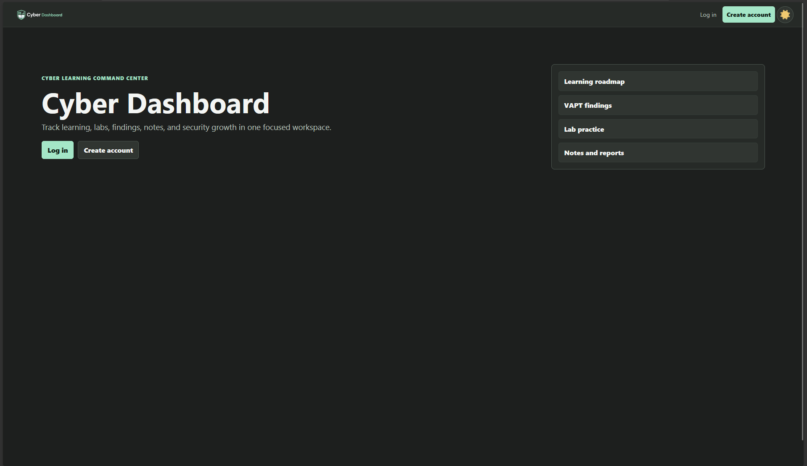 | 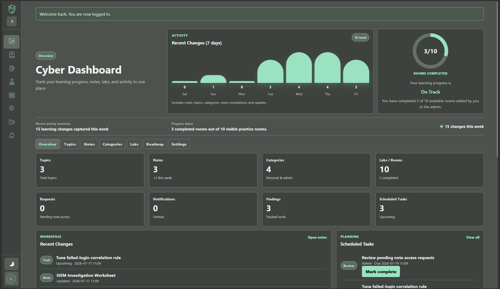 |
| 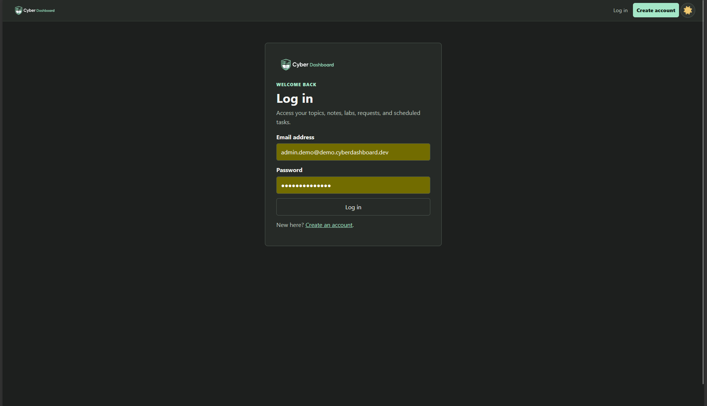 | 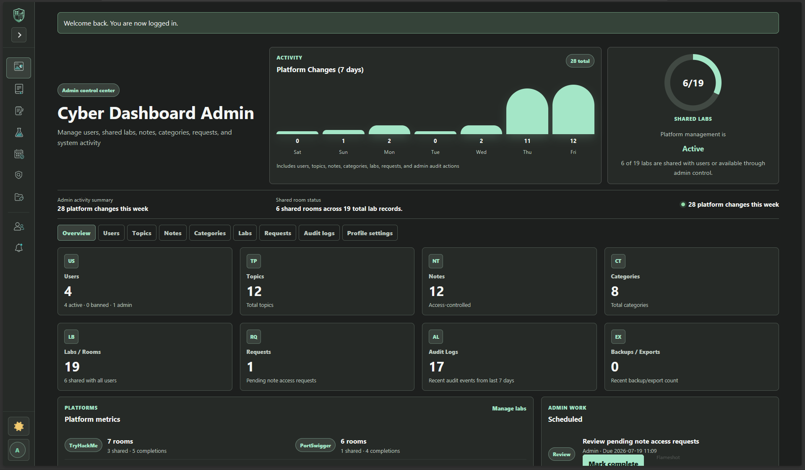 |
| 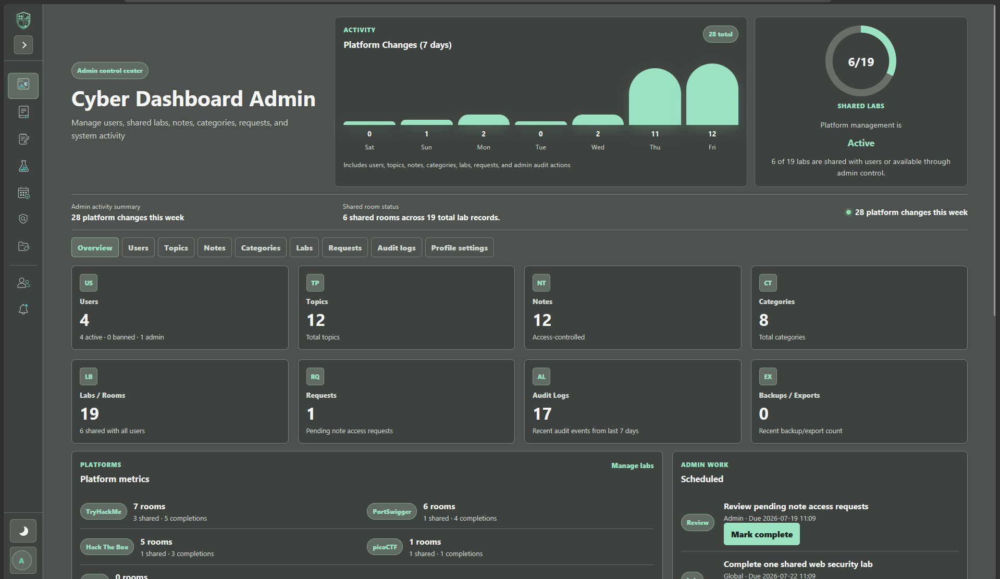 | 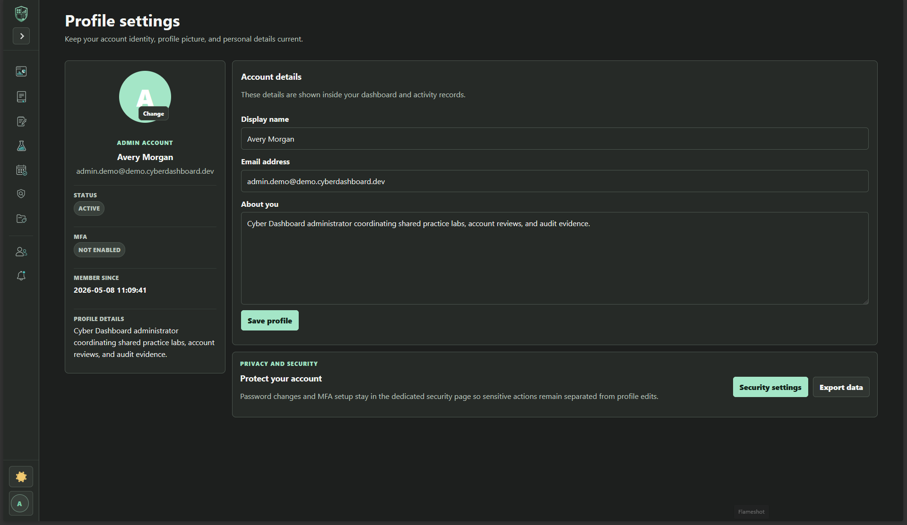 |

| Learning workspace | Administration and verification |
|---|---|
| 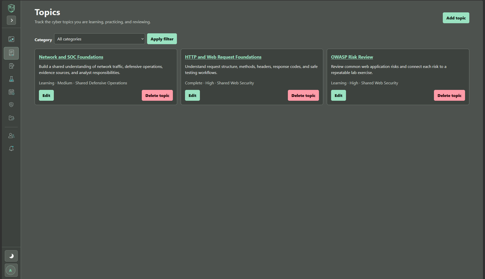 | 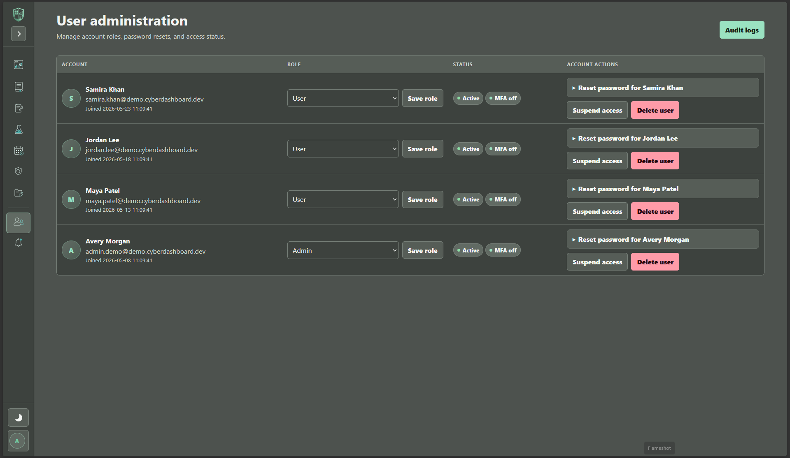 |
| 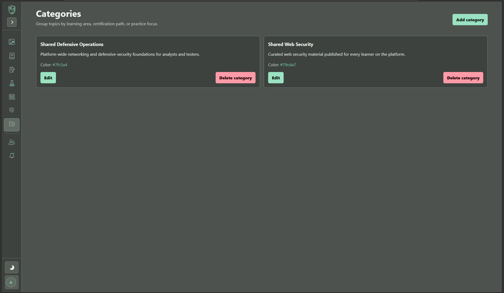 |  |
| 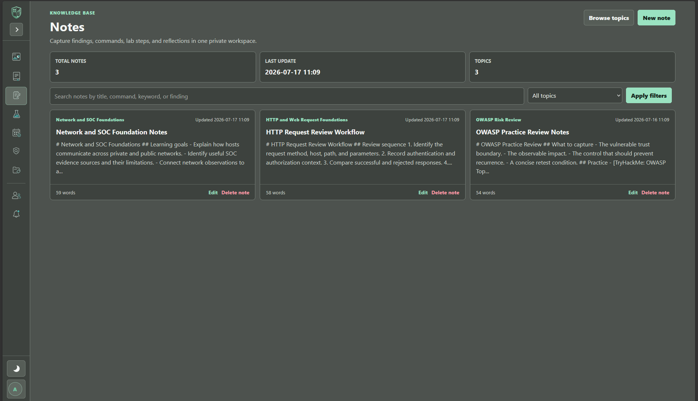 | 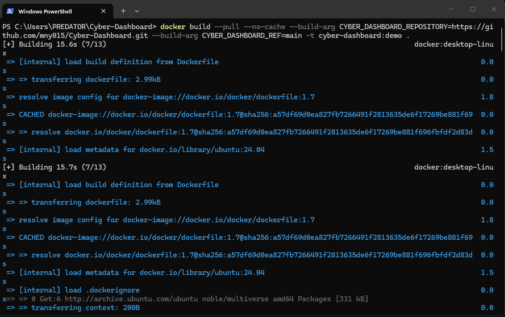 |
| 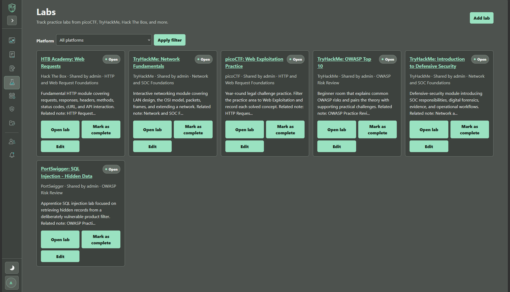 | 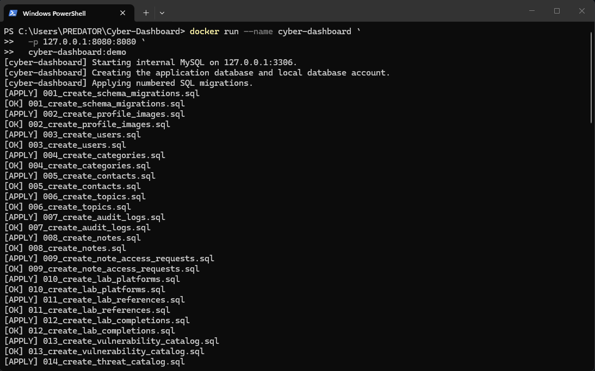 |

Brand assets used by the application are stored in `app/static/image/`:

- `logo-dark.png`
- `Favicon.png`
- High-contrast `*-dark.png` sidebar navigation icons

## Manual Test Data

A guarded test-data injector is available at `docs/inject_test_data.py`. It creates
correlated demo users, categories, topics, notes, labs, findings, tasks, activity,
and note-access requests without changing the schema.

```powershell
python docs/inject_test_data.py --confirm-db cyber_dashboard
```

Use `--dry-run` to validate it without writing, or `--replace` to refresh only its
fixed demo accounts. See [docs/TEST_DATA_INJECTOR.md](docs/TEST_DATA_INJECTOR.md)
for the generated accounts, safety checks, and full usage instructions.

## Technology

- Python 3.13 (the version used by CI)
- Flask 3, Jinja2, Flask-Login, Flask-WTF, and WTForms
- MySQL 8 and synchronous PyMySQL
- Flask-Limiter and Flask-Talisman
- Werkzeug password hashing, PyOTP, qrcode, and Fernet encryption
- Plain CSS and vanilla JavaScript
- Docker with an Ubuntu/MySQL all-in-one verification image
- pytest, Ruff, Bandit, and Radon

## Final Folder Structure

```text
Cyber Dashboard/
|-- app/
|   |-- controllers/             # HTTP request and response handling
|   |-- database/queries/        # Complex runtime reports and exports
|   |-- forms/                   # Flask-WTF forms and action forms
|   |-- models/                  # Plain slotted dataclasses
|   |-- repositories/            # Parameterized persistence and ownership rules
|   |-- routes/                  # Blueprint and add_url_rule mappings only
|   |-- services/                # Multi-step business workflows
|   |-- static/                  # CSS, JavaScript, logos, and favicons
|   |-- templates/               # Jinja pages, macros, and partials
|   |-- utils/
|   |   `-- database/            # Pool, transactions, query builder, named SQL
|   |-- extensions.py            # Shared Flask extension instances
|   `-- __init__.py              # Application factory
|-- docs/                        # Architecture and relationship documentation
|-- docker/                      # All-in-one container startup script
|-- migrations/                  # Authoritative numbered SQL schema history
|-- scripts/                     # Migration, seed, admin, and maintenance commands
|-- tests/                       # Focused unit and application-flow tests
|-- .dockerignore                # Excludes local secrets and build noise
|-- Dockerfile                   # GitHub-sourced Ubuntu/MySQL demo image
|-- config.py                    # Environment-driven runtime configurations
|-- run.py                       # Local development entry point
|-- wsgi.py                      # Production WSGI entry point
|-- requirements.txt             # Runtime dependencies
`-- requirements-dev.txt         # Runtime plus development dependencies
```

## Architecture

The project uses a practical Model-View-Controller interpretation:

- **Model:** plain dataclasses represent application data; repositories load and persist it.
- **View:** Jinja templates and reusable macros render HTML.
- **Controller:** plain functions process HTTP input, validate forms, call repositories or services, and return templates, redirects, downloads, or errors.
- **Routes:** Blueprint modules only declare URL paths, methods, endpoint names, and direct controller mappings with `add_url_rule()`.

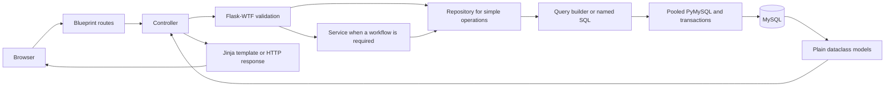

### Route And Controller Separation

All 14 Blueprints and 72 application routes are registered centrally by `app/routes/__init__.py`. Route files contain no form processing, rendering, business workflows, or SQL. Authentication and authorization decorators are applied to controller functions. The complete function-level mapping is documented in [`docs/CONTROLLER_MAP.md`](docs/CONTROLLER_MAP.md).

### Request Lifecycle

1. A Blueprint route maps the URL and method directly to a controller function.
2. The controller authenticates and authorizes the request through shared decorators.
3. Flask-WTF validates state-changing input and CSRF tokens.
4. Simple reads call a repository; multi-step rules call a service.
5. The repository uses the query builder or a named SQL report through the pooled database layer.
6. Explicit transactions commit complete workflows or roll them back on failure.
7. Rows become plain dataclass models where an entity model improves clarity.
8. The controller returns a Jinja page, redirect, download, JSON response, or safe HTTP error.

### Query Builder

`app/utils/database/query_builder.py` handles normal CRUD, filtering, joins, ordering, and pagination. It validates table and column identifiers against model metadata, whitelists operators and sort directions, parameterizes every data value, and prevents `UPDATE` or `DELETE` without a `WHERE` clause by default.

### Named SQL

`app/database/queries/` contains named `.sql` files for dashboard metrics, aggregate reports, exports, and multi-table ownership or visibility projections. The loader accepts validated query names, blocks traversal, verifies named parameters, and caches file contents. Simple writes and single-table CRUD do not belong in this directory.

### No ORM

The application does not use SQLAlchemy, Flask-SQLAlchemy, Alembic, Peewee, Django ORM, active-record persistence, lazy loading, or asynchronous database drivers. Models are passive dataclasses. Repositories execute parameterized SQL through synchronous PyMySQL.

## Setup On Windows

Run these commands from PowerShell in the project root.

```powershell
git clone https://github.com/mny015/Cyber-Dashboard.git
cd "Cyber-Dashboard"
py -3.13 -m venv .venv
Set-ExecutionPolicy -Scope Process -ExecutionPolicy RemoteSigned
.\.venv\Scripts\Activate.ps1
python -m pip install --upgrade pip
python -m pip install -r requirements.txt
Copy-Item .env.example .env
```

Use `requirements.txt`, including the `.txt` extension.

## Environment Variables

Edit the local `.env` copied from `.env.example`. Do not commit `.env`.

| Variable | Purpose |
|---|---|
| `APP_ENV` | `development`, `testing`, or `production` |
| `SECRET_KEY` | Flask session and CSRF signing secret |
| `DB_HOST`, `DB_PORT` | MySQL server address |
| `DB_USER`, `DB_PASSWORD`, `DB_NAME` | MySQL credentials and database |
| `DB_CHARSET` | Connection charset; normally `utf8mb4` |
| `DB_POOL_SIZE`, `DB_POOL_TIMEOUT` | Synchronous connection-pool settings |
| `MFA_ENCRYPTION_KEY` | Fernet key used to encrypt TOTP secrets |
| `REAUTHENTICATION_MAX_AGE` | Maximum sensitive-action reconfirmation age |
| `TRUSTED_PROXY_HOPS` | Explicit trusted proxy depth for client addresses |
| `PROFILE_IMAGE_MAX_BYTES` | Profile-image size limit |
| `SESSION_COOKIE_SECURE` | Secure-cookie switch for local or TLS environments |
| `RATELIMIT_STORAGE_URI` | Limiter storage; use shared storage in production |
| `LOG_FILE` | Application log path |
| `FLASK_HOST`, `FLASK_PORT` | Local development bind address and port |

Generate the MFA encryption key with:

```powershell
python -c "from cryptography.fernet import Fernet; print(Fernet.generate_key().decode())"
```

Production configuration rejects missing or placeholder credentials, a short `SECRET_KEY`, an invalid MFA encryption key, and in-memory rate-limit storage.

## Database Migrations

Numbered files in `migrations/` are the single authoritative schema history. Schema creation and compatibility changes do not run during web requests, and there is no competing Alembic migration system.

```powershell
python scripts/migrate.py
python scripts/seed.py
python scripts/check_database.py
python scripts/create_admin.py
```

The migration runner creates the configured database and `schema_migrations` ledger when needed, executes unapplied files in filename order, records checksums, and never reruns an applied migration. Seed data is deliberately separate. Never edit an applied migration; add the next numbered `.sql` file.

Run `python scripts/migrate.py` after every pull or branch update and before
starting the application. Pages backed by newer schema objects, including note
access notifications, require the current migration set. If a database-backed
page fails after an update, apply migrations and then verify the connection:

```powershell
python scripts/migrate.py
python scripts/check_database.py
```

The final schema contains 20 application tables plus the `schema_migrations` ledger. Foreign-key deletion and index decisions are documented in [`docs/DATABASE_RELATIONSHIPS.md`](docs/DATABASE_RELATIONSHIPS.md).

## Run Locally

```powershell
python run.py
```

Open `http://127.0.0.1:5000`. On Windows, use the active virtual environment's `python`; `python3` may resolve to a different installation.

## Self-Contained Docker Demo

The root [`Dockerfile`](Dockerfile) builds a coursework/demo image containing:

- Ubuntu Linux
- Python and the runtime packages from `requirements.txt`
- Gunicorn
- A local MySQL server available only inside the container
- Cyber Dashboard cloned from the public
  [`mny015/Cyber-Dashboard`](https://github.com/mny015/Cyber-Dashboard) repository
- Automatic numbered migrations, reference-catalog seeding, and realistic demo data

This intentionally runs the application and MySQL in one container so another
person can verify the project without installing Python or MySQL. It is not the
recommended architecture for a production deployment.

### 1. Build The Image

Start Docker Desktop and open a terminal in the project root. This one-line
command works unchanged in Linux shells, Windows Command Prompt, and PowerShell:

```text
docker build --pull --no-cache --build-arg CYBER_DASHBOARD_REPOSITORY=https://github.com/mny015/Cyber-Dashboard.git --build-arg CYBER_DASHBOARD_REF=main -t cyber-dashboard:demo .
```

The Dockerfile clones the selected GitHub branch during the build. The local
application files are not copied into the image. Use `--no-cache` whenever the
GitHub branch has changed, or set `CYBER_DASHBOARD_REF` to another public branch
or tag.

### 2. Run At Localhost:8080

For a quick disposable container:

```text
docker run --name cyber-dashboard -p 127.0.0.1:8080:8080 cyber-dashboard:demo
```

Wait until the log says that Cyber Dashboard is starting, then open:

```text
http://localhost:8080
```

The first startup creates linked demo users, categories, topics, notes, labs,
completions, findings, tasks, activity, and note-access records. Sign in with:

```text
Administrator: admin.demo@demo.cyberdashboard.dev
Password:      CyberDemo2026!
```

The other generated account emails are printed in the container log and use
the same password. Set `LOAD_DEMO_DATA=false` to start with catalogs only, or
override `DEMO_DATA_PASSWORD` when running the container. Demo records are
inserted only when the fixed demo administrator is absent, so restarting the
container does not reset changes made by the tester.

Only port `8080` is published. MySQL remains bound to `127.0.0.1:3306` inside
the container and cannot be reached directly from the host.

Press `Ctrl+C` to stop an attached container. Start the same container again
with:

```powershell
docker start -a cyber-dashboard
```

### 3. Keep Database Data Across Replacement Containers

Without a volume, data survives `docker stop` and `docker start`, but is deleted
when the container is removed. For reusable verification data, use a named
Docker volume:

```powershell
docker volume create cyber-dashboard-mysql

docker run -d `
  --name cyber-dashboard `
  -p 127.0.0.1:8080:8080 `
  -v cyber-dashboard-mysql:/var/lib/mysql `
  cyber-dashboard:demo
```

The volume is local to Docker on the verifier's computer. No remote database is
used.

### 4. Create An Administrator

After the container is running:

```powershell
docker exec -it cyber-dashboard python scripts/create_admin.py
```

Enter a valid email, display name, and password when prompted. Normal users can
also register through `http://localhost:8080/auth/register`.

### 5. Inspect And Troubleshoot

```powershell
docker ps
docker logs -f cyber-dashboard
docker inspect --format "{{json .State.Health}}" cyber-dashboard
docker exec `
  -e MYSQL_PWD=cyber_dashboard_demo `
  cyber-dashboard mysql `
  --host=127.0.0.1 `
  --user=cyber_dashboard_user `
  --execute="SHOW TABLES;" `
  cyber_dashboard
```

The image health check calls `/api/ping`. On every container start, the startup
script waits for MySQL, safely creates the local database account, applies only
unapplied migrations, refreshes seed catalogs, loads demo records when needed,
and then starts Gunicorn.

### 6. Reset The Demo

Remove only the container:

```powershell
docker rm -f cyber-dashboard
```

Also remove the optional database volume for a completely fresh database:

```powershell
docker volume rm cyber-dashboard-mysql
```

Then run the build and run commands again.

### 7. Share The Built Image

Export the fully built image to a file:

```powershell
docker save -o cyber-dashboard-demo.tar cyber-dashboard:demo
```

On another computer with Docker:

```powershell
docker load -i cyber-dashboard-demo.tar
docker run --name cyber-dashboard `
  -p 127.0.0.1:8080:8080 `
  cyber-dashboard:demo
```

The recipient does not need Git or internet access at runtime because the
GitHub source snapshot and dependencies are already inside the built image.

### Demo Security Note

The image contains obvious local-only database and application defaults to make
coursework verification straightforward. Do not publish this all-in-one image
as a production service. When sharing outside a trusted verification setting,
override at least `SECRET_KEY`, `DB_PASSWORD`, and `MFA_ENCRYPTION_KEY` with
`docker run -e NAME=value ...`, and keep port `3306` unpublished.

## Production Startup

Set `APP_ENV=production`, supply every required production environment variable, apply migrations as a deployment step, and serve `wsgi:app` with a production WSGI server behind TLS. The WSGI server is deployment-specific and is not pinned by this coursework repository.

Linux example after installing Gunicorn in the deployment environment:

```bash
gunicorn --bind 127.0.0.1:8000 wsgi:app
```

Windows example after installing Waitress in the deployment environment:

```powershell
waitress-serve --host=127.0.0.1 --port=8000 wsgi:app
```

Terminate TLS at a trusted reverse proxy, configure shared rate-limit storage such as Redis, set proxy trust deliberately, and never use `python run.py` as the public production server.

## Tests And Quality Checks

Install development tools and run the same gates used by CI:

```powershell
python -m pip install -r requirements-dev.txt
python -m compileall -q app scripts tests config.py run.py wsgi.py
python -m ruff check app scripts tests config.py run.py wsgi.py
python -m bandit -r app scripts config.py run.py wsgi.py -c pyproject.toml
python -m radon cc app scripts -s -a
python -m flask --app run routes
python -m pytest tests -v
```

Database-backed application-flow tests require an explicitly named dedicated test
database. Initialize it before running the suite:

```powershell
$env:DB_NAME="cyber_dashboard_test"
$env:TEST_DB_NAME="cyber_dashboard_test"
python scripts/migrate.py
python scripts/seed.py
python -m pytest tests -v
```

Never point destructive test fixtures at a development or production database.

## Security Features

- Flask-Login protects private pages; admin controllers require role authorization.
- Repository predicates enforce ownership for user-owned records.
- Flask-WTF and CSRF protect every state-changing form.
- State changes use POST and POST/Redirect/GET where appropriate.
- Passwords use Werkzeug hashes; MFA secrets use environment-keyed Fernet encryption.
- Sensitive exports and administrator account actions require recent identity reconfirmation.
- Login and registration limits use centralized per-IP and per-account policies.
- Production cookies are `HttpOnly`, `SameSite=Lax`, and secure over HTTPS.
- Flask-Talisman provides CSP, HSTS, frame, and related response protections.
- Uploads are checked by extension, MIME type, image signature, and size before database storage.
- Parameterized SQL, strict identifier validation, and guarded writes reduce injection risk.
- Audit records survive account deletion through `ON DELETE SET NULL` relationships.
- Production debug mode is disabled and configuration is validated before startup.

These controls reduce risk but do not replace dependency maintenance, secure host configuration, backups, monitoring, or an independent penetration test.

## Theme And Accessibility

The main page background is a plain theme variable. Meaningful surfaces use
restrained borders and spacing, while the shared high-contrast logo, favicon,
and navigation icons remain visible in both themes. Templates preserve explicit
labels, focus indicators, keyboard navigation, semantic landmarks, error
announcements, and reduced-motion support.

## Documentation

Each maintained document has one purpose:

- [`README.md`](README.md): authoritative project overview, setup, operation, testing, and deployment guide
- [`docs/ARCHITECTURE.md`](docs/ARCHITECTURE.md): final layer responsibilities, request flow, and architecture constraints
- [`docs/CONTROLLER_MAP.md`](docs/CONTROLLER_MAP.md): route-controller dependencies and response destinations
- [`docs/DATABASE_RELATIONSHIPS.md`](docs/DATABASE_RELATIONSHIPS.md): foreign keys, deletion rules, and index policy
- [`docs/TEST_DATA_INJECTOR.md`](docs/TEST_DATA_INJECTOR.md): guarded manual demonstration-data instructions
- [`migrations/README.md`](migrations/README.md): numbered migration policy and commands

## Known Limitations

- Scheduled tasks do not support recurrence or a background reminder worker.
- Notifications currently focus on note-access requests.
- The API surface is intentionally limited to a health-style ping endpoint.
- Historical `work_logs`, `roadmap_items`, `progress_reflections`, and `activity_events` remain preserved in the schema but have no dedicated current UI.
- Export is implemented; import/restore is not.
- A production WSGI server, reverse proxy, Redis service, monitoring, and backup retention policy remain deployment responsibilities.

## Repository

[https://github.com/mny015/Cyber-Dashboard](https://github.com/mny015/Cyber-Dashboard)
