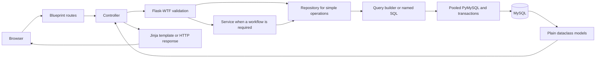

# Cyber Dashboard

Cyber Dashboard is a Flask, Jinja, and MySQL application for organizing cybersecurity learning, lab practice, notes, findings, scheduled work, and privacy-aware administration.

Repository: [github.com/mny015/Cyber-Dashboard](https://github.com/mny015/Cyber-Dashboard)

## Project Overview

The application gives each user a private workspace for tracking topics, categories, notes, contacts, labs, tasks, and security findings. Administrators can manage accounts, publish shared labs, review vulnerability suggestions, inspect audit evidence, and request access to a specific private note. A note remains private until its owner explicitly approves that request.

The backend is intentionally synchronous and coursework-friendly. It uses Flask Blueprints, plain controller functions, plain Python dataclasses, repositories, focused workflow services, a safe query builder, named SQL for reports, numbered SQL migrations, and parameterized PyMySQL calls. No ORM is used.

## Features

- Registration, login, POST-only logout, password changes, session invalidation, and account lockout controls.
- Administrator user management: roles, ban/unban, password reset, and deletion.
- TOTP MFA setup and verification, with encrypted secrets at rest.
- Per-user topic, category, contact, note, lab, task, and finding management.
- Markdown note editing, search, topic links, soft deletion, and owner-scoped access.
- Admin note-access requests with user notifications and explicit approval or denial.
- Lab references for picoCTF, TryHackMe, Hack The Box, and other platforms.
- Admin-owned public labs and per-user completion tracking.
- Vulnerability and threat catalogs, user findings, suggestions, and admin review.
- User and administrator dashboards with relevant activity, work, and platform metrics.
- JSON and CSV/ZIP exports protected by short-lived download tickets.
- Database-backed, signature-checked profile images.
- Audit logs for authentication, administration, exports, labs, tasks, findings, and core CRUD actions.
- Responsive light and dark themes with theme-aware logos and favicons.

## Screenshots

Screenshot binaries are not currently committed. The recommended documentation location is `docs/screenshots/`; useful captures are the login page, user dashboard, admin dashboard, notes, labs, and scheduled tasks in both themes. Keeping this section explicit avoids broken image links while the final portfolio captures are prepared.

Brand assets used by the application are stored in `app/static/image/`:

- `logo-light.png`
- `logo-dark.png`
- `favicon-light.png`
- `favicon-dark.png`

## Technology

- Python 3.13 (the version used by CI)
- Flask 3, Jinja2, Flask-Login, Flask-WTF, and WTForms
- MySQL 8 and synchronous PyMySQL
- Flask-Limiter and Flask-Talisman
- Werkzeug password hashing, PyOTP, qrcode, and Fernet encryption
- Plain CSS and vanilla JavaScript
- pytest, Ruff, Bandit, and Radon

## Final Folder Structure

```text
Cyber Dashboard/
|-- app/
|   |-- controllers/             # HTTP request and response handling
|   |-- database/queries/        # Complex runtime reports and exports
|   |-- forms/                   # Flask-WTF forms and action forms
|   |-- models/                  # Plain slotted dataclasses
|   |-- repositories/            # Parameterized persistence and ownership rules
|   |-- routes/                  # Blueprint and add_url_rule mappings only
|   |-- services/                # Multi-step business workflows
|   |-- static/                  # CSS, JavaScript, logos, and favicons
|   |-- templates/               # Jinja pages, macros, and partials
|   |-- utils/
|   |   `-- database/            # Pool, transactions, query builder, named SQL
|   |-- extensions.py            # Shared Flask extension instances
|   `-- __init__.py              # Application factory
|-- docs/                        # Architecture and relationship documentation
|-- migrations/                  # Authoritative numbered SQL schema history
|-- scripts/                     # Migration, seed, admin, and maintenance commands
|-- tests/                       # Unit, contract, integration, and security tests
|-- config.py                    # Environment-driven runtime configurations
|-- run.py                       # Local development entry point
|-- wsgi.py                      # Production WSGI entry point
|-- requirements.txt             # Runtime dependencies
`-- requirements-dev.txt         # Runtime plus development dependencies
```

## Architecture

The project uses a practical Model-View-Controller interpretation:

- **Model:** plain dataclasses represent application data; repositories load and persist it.
- **View:** Jinja templates and reusable macros render HTML.
- **Controller:** plain functions process HTTP input, validate forms, call repositories or services, and return templates, redirects, downloads, or errors.
- **Routes:** Blueprint modules only declare URL paths, methods, endpoint names, and direct controller mappings with `add_url_rule()`.



### Route And Controller Separation

All 14 Blueprints and 72 application routes are registered centrally by `app/routes/__init__.py`. Route files contain no form processing, rendering, business workflows, or SQL. Authentication and authorization decorators are applied to controller functions. The complete function-level mapping is documented in [`docs/CONTROLLER_MAP.md`](docs/CONTROLLER_MAP.md).

### Request Lifecycle

1. A Blueprint route maps the URL and method directly to a controller function.
2. The controller authenticates and authorizes the request through shared decorators.
3. Flask-WTF validates state-changing input and CSRF tokens.
4. Simple reads call a repository; multi-step rules call a service.
5. The repository uses the query builder or a named SQL report through the pooled database layer.
6. Explicit transactions commit complete workflows or roll them back on failure.
7. Rows become plain dataclass models where an entity model improves clarity.
8. The controller returns a Jinja page, redirect, download, JSON response, or safe HTTP error.

### Query Builder

`app/utils/database/query_builder.py` handles normal CRUD, filtering, joins, ordering, and pagination. It validates table and column identifiers against model metadata, whitelists operators and sort directions, parameterizes every data value, and prevents `UPDATE` or `DELETE` without a `WHERE` clause by default.

### Named SQL

`app/database/queries/` contains named `.sql` files for dashboard metrics, aggregate reports, exports, and multi-table ownership or visibility projections. The loader accepts validated query names, blocks traversal, verifies named parameters, and caches file contents. Simple writes and single-table CRUD do not belong in this directory.

### No ORM

The application does not use SQLAlchemy, Flask-SQLAlchemy, Alembic, Peewee, Django ORM, active-record persistence, lazy loading, or asynchronous database drivers. Models are passive dataclasses. Repositories execute parameterized SQL through synchronous PyMySQL.

## Setup On Windows

Run these commands from PowerShell in the project root.

```powershell
git clone https://github.com/mny015/Cyber-Dashboard.git
cd "Cyber-Dashboard"
py -3.13 -m venv .venv
Set-ExecutionPolicy -Scope Process -ExecutionPolicy RemoteSigned
.\.venv\Scripts\Activate.ps1
python -m pip install --upgrade pip
python -m pip install -r requirements.txt
Copy-Item .env.example .env
```

Use `requirements.txt`, including the `.txt` extension.

## Environment Variables

Edit the local `.env` copied from `.env.example`. Do not commit `.env`.

| Variable | Purpose |
|---|---|
| `APP_ENV` | `development`, `testing`, or `production` |
| `SECRET_KEY` | Flask session and CSRF signing secret |
| `DB_HOST`, `DB_PORT` | MySQL server address |
| `DB_USER`, `DB_PASSWORD`, `DB_NAME` | MySQL credentials and database |
| `DB_CHARSET` | Connection charset; normally `utf8mb4` |
| `DB_POOL_SIZE`, `DB_POOL_TIMEOUT` | Synchronous connection-pool settings |
| `MFA_ENCRYPTION_KEY` | Fernet key used to encrypt TOTP secrets |
| `REAUTHENTICATION_MAX_AGE` | Maximum sensitive-action reconfirmation age |
| `TRUSTED_PROXY_HOPS` | Explicit trusted proxy depth for client addresses |
| `PROFILE_IMAGE_MAX_BYTES` | Profile-image size limit |
| `SESSION_COOKIE_SECURE` | Secure-cookie switch for local or TLS environments |
| `RATELIMIT_STORAGE_URI` | Limiter storage; use shared storage in production |
| `LOG_FILE` | Application log path |
| `FLASK_HOST`, `FLASK_PORT` | Local development bind address and port |

Generate the MFA encryption key with:

```powershell
python -c "from cryptography.fernet import Fernet; print(Fernet.generate_key().decode())"
```

Production configuration rejects missing or placeholder credentials, a short `SECRET_KEY`, an invalid MFA encryption key, and in-memory rate-limit storage.

## Database Migrations

Numbered files in `migrations/` are the single authoritative schema history. Schema creation and compatibility changes do not run during web requests, and there is no competing Alembic migration system.

```powershell
python scripts/migrate.py
python scripts/seed.py
python scripts/check_database.py
python scripts/create_admin.py
```

The migration runner creates the configured database and `schema_migrations` ledger when needed, executes unapplied files in filename order, records checksums, and never reruns an applied migration. Seed data is deliberately separate. Never edit an applied migration; add the next numbered `.sql` file.

The final schema contains 19 application tables plus the `schema_migrations` ledger. Foreign-key deletion and index decisions are documented in [`docs/DATABASE_RELATIONSHIPS.md`](docs/DATABASE_RELATIONSHIPS.md).

## Run Locally

```powershell
python run.py
```

Open `http://127.0.0.1:5000`. On Windows, use the active virtual environment's `python`; `python3` may resolve to a different installation.

## Production Startup

Set `APP_ENV=production`, supply every required production environment variable, apply migrations as a deployment step, and serve `wsgi:app` with a production WSGI server behind TLS. The WSGI server is deployment-specific and is not pinned by this coursework repository.

Linux example after installing Gunicorn in the deployment environment:

```bash
gunicorn --bind 127.0.0.1:8000 wsgi:app
```

Windows example after installing Waitress in the deployment environment:

```powershell
waitress-serve --host=127.0.0.1 --port=8000 wsgi:app
```

Terminate TLS at a trusted reverse proxy, configure shared rate-limit storage such as Redis, set proxy trust deliberately, and never use `python run.py` as the public production server.

## Tests And Quality Checks

Install development tools and run the same gates used by CI:

```powershell
python -m pip install -r requirements-dev.txt
python -m compileall -q app scripts tests config.py run.py wsgi.py
python -m ruff check app scripts tests config.py run.py wsgi.py
python -m bandit -r app scripts config.py run.py wsgi.py -c pyproject.toml
python -m radon cc app scripts -s -a
python -m flask --app run routes
python -m pytest tests -v
```

Database tests require an explicitly named test database. Migration integration tests reject unsafe names and only create or remove databases containing `migration_test`:

```powershell
$env:TEST_DB_NAME="cyber_dashboard_test"
$env:MIGRATION_TEST_DB_NAME="cyber_dashboard_migration_test"
$env:MIGRATION_EXISTING_SOURCE_DB_NAME="cyber_dashboard"
python -m pytest tests/test_migrations_integration.py -v -m integration
```

Never point destructive test fixtures at a development or production database.

## Security Features

- Flask-Login protects private pages; admin controllers require role authorization.
- Repository predicates enforce ownership for user-owned records.
- Flask-WTF and CSRF protect every state-changing form.
- State changes use POST and POST/Redirect/GET where appropriate.
- Passwords use Werkzeug hashes; MFA secrets use environment-keyed Fernet encryption.
- Sensitive exports and administrator account actions require recent identity reconfirmation.
- Login and registration limits use centralized per-IP and per-account policies.
- Production cookies are `HttpOnly`, `SameSite=Lax`, and secure over HTTPS.
- Flask-Talisman provides CSP, HSTS, frame, and related response protections.
- Uploads are checked by extension, MIME type, image signature, and size before database storage.
- Parameterized SQL, strict identifier validation, and guarded writes reduce injection risk.
- Audit records survive account deletion through `ON DELETE SET NULL` relationships.
- Production debug mode is disabled and configuration is validated before startup.

These controls reduce risk but do not replace dependency maintenance, secure host configuration, backups, monitoring, or an independent penetration test.

## Theme And Accessibility

The main page background is a plain theme variable. Meaningful surfaces use restrained borders and spacing, while light/dark logos and favicons switch with the saved theme. Templates preserve explicit labels, focus indicators, keyboard navigation, semantic landmarks, error announcements, and reduced-motion support.

## Documentation

- [`docs/ARCHITECTURE.md`](docs/ARCHITECTURE.md): layer responsibilities and request flow
- [`docs/ARCHITECTURE_FREEZE.md`](docs/ARCHITECTURE_FREEZE.md): frozen backend contracts and quality baseline
- [`docs/CONTROLLER_MAP.md`](docs/CONTROLLER_MAP.md): all controller functions and dependencies
- [`docs/DATABASE_RELATIONSHIPS.md`](docs/DATABASE_RELATIONSHIPS.md): foreign keys, deletion rules, and indexes
- [`docs/MIGRATION_STATUS.md`](docs/MIGRATION_STATUS.md): completed migration status
- [`docs/FINAL_PROJECT_AUDIT.md`](docs/FINAL_PROJECT_AUDIT.md): final audit evidence and deployment checklist

## Known Limitations

- Scheduled tasks do not support recurrence or a background reminder worker.
- Notifications currently focus on note-access requests.
- The API surface is intentionally limited to a health-style ping endpoint.
- Historical `work_logs`, `roadmap_items`, `progress_reflections`, and `activity_events` remain preserved in the schema but have no dedicated current UI.
- Export is implemented; import/restore is not.
- Portfolio screenshots and demo media are not committed yet.
- A production WSGI server, reverse proxy, Redis service, monitoring, and backup retention policy remain deployment responsibilities.

## Repository

[https://github.com/mny015/Cyber-Dashboard](https://github.com/mny015/Cyber-Dashboard)
