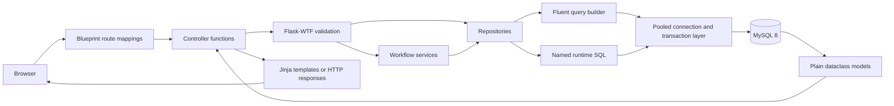
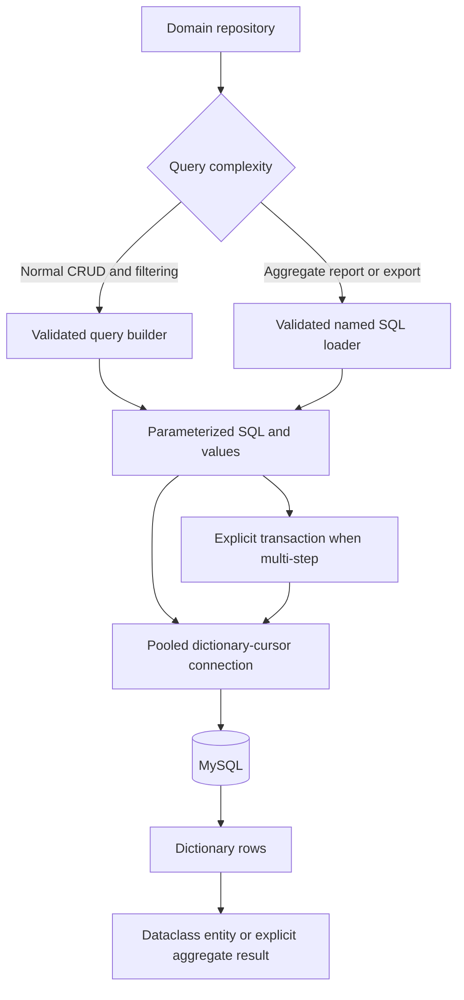

# Final Project Audit

Audit date: 2026-07-14

Branch: `test`
Baseline commit: `0573a93`

## Executive Verdict

Cyber Dashboard satisfies its frozen layered architecture and its core route, database, security, and behavior contracts. All 253 tests pass when the dedicated MySQL test databases are enabled. Compile checks, Ruff, Bandit, Flask route listing, clean/existing migration tests, and Radon also pass.

No backend restructuring was performed during this audit. The only project change is documentation: the README was corrected to describe the implemented architecture, and this evidence report was added.

## Final Architecture



### Architecture Verification

| Requirement | Result | Evidence |
|---|---|---|
| Routes and controllers are separate | Pass | Route modules contain Blueprint construction and `add_url_rule()` mappings only. |
| Controllers own HTTP behavior | Pass | Controllers process forms, current user state, templates, redirects, downloads, and errors. |
| Repositories own data access | Pass | Controller SQL scans and architecture tests are clean; repository tests enforce the boundary. |
| Services contain real workflows | Pass | Services coordinate transactions, audit, notification, auth, export, and account-management rules. |
| Models are plain dataclasses | Pass | All 19 entity models are slotted dataclasses with no persistence methods or request access. |
| Utilities are centralized | Pass | Shared authorization, rate limits, redirects, validation, uploads, time helpers, and database tools live under `app/utils/`. |
| No ORM exists | Pass | Requirements, imports, architecture tests, and source scans contain no ORM runtime. |
| No async database code exists | Pass | The application uses synchronous PyMySQL and contains no async database architecture. |

## Database Flow



### Database Verification

| Requirement | Result | Evidence |
|---|---|---|
| Numbered migrations are authoritative | Pass | 27 migrations are ordered in `migrations/`; Python schema DDL and Alembic are absent. |
| Clean database migration | Pass | All migrations apply once and are not rerun. |
| Existing database migration | Pass | A copied legacy schema is upgraded while fixture data is preserved. |
| Query values are parameterized | Pass | Builder and named-query parameter tests pass; values remain separate from generated SQL. |
| Identifiers are validated | Pass | Table, column, operator, direction, and query-name rejection tests pass. |
| Guarded writes | Pass | Mass `UPDATE` and `DELETE` are rejected without a `WHERE` clause. |
| Foreign-key rules are intentional | Pass | 28 relationships are frozen and tested for CASCADE, SET NULL, RESTRICT, and violations. |
| Important indexes exist | Pass | Schema/relationship contracts and `EXPLAIN` tests verify required lookup and relationship indexes. |
| Transactions protect workflows | Pass | Commit, rollback, failure conversion, and workflow rollback tests pass. |

The schema contains 19 application tables plus the `schema_migrations` ledger. Audit records use `ON DELETE SET NULL` for deleted actors, while owner-dependent records generally cascade. Optional historical links use `SET NULL`; referenced profile images and lab platforms use `RESTRICT` where deletion would invalidate a live reference.

## Route-To-Controller Map

All 72 application routes match `tests/contracts/route_contract.json`. Flask also registers its normal static-file route.

| Blueprint | Routes | Route module | Controller module |
|---|---:|---|---|
| `dashboard` | 4 | `app/routes/dashboard.py` | `app/controllers/dashboard_controller.py` |
| `auth` | 8 | `app/routes/auth.py` | `app/controllers/auth_controller.py` |
| `admin` | 12 | `app/routes/admin.py` | `app/controllers/admin_controller.py` |
| `backup` | 6 | `app/routes/backup.py` | `app/controllers/backup_controller.py` |
| `api` | 1 | `app/routes/api.py` | `app/controllers/api_controller.py` |
| `categories` | 4 | `app/routes/categories.py` | `app/controllers/categories_controller.py` |
| `topics` | 5 | `app/routes/topics.py` | `app/controllers/topics_controller.py` |
| `contacts` | 4 | `app/routes/contacts.py` | `app/controllers/contacts_controller.py` |
| `notes` | 5 | `app/routes/notes.py` | `app/controllers/notes_controller.py` |
| `labs` | 7 | `app/routes/labs.py` | `app/controllers/labs_controller.py` |
| `notifications` | 3 | `app/routes/notifications.py` | `app/controllers/notifications_controller.py` |
| `profile` | 2 | `app/routes/profile.py` | `app/controllers/profile_controller.py` |
| `security` | 8 | `app/routes/security.py` | `app/controllers/security_controller.py` |
| `tasks` | 3 | `app/routes/scheduled_tasks.py` | `app/controllers/scheduled_tasks_controller.py` |

The function-level route, dependency, template, redirect, and response map is maintained in `docs/CONTROLLER_MAP.md`.

## Security Verification

| Control | Result | Evidence |
|---|---|---|
| Private dashboards require login | Pass | Anonymous dashboard contract tests redirect to login. |
| Admin routes require role authorization | Pass | Shared decorators and user/admin route tests enforce 403 behavior. |
| Ownership is enforced in data access | Pass | Repository predicates include both record and owner identifiers; cross-owner tests pass. |
| CSRF is enabled | Pass | Flask-WTF is centralized; missing-token and rendered-form tests pass. |
| State changes use POST forms | Pass | Route contract finds no mutating GET action; PRG tests pass. |
| Rate limits are centralized | Pass | Shared constants and per-account login limit tests pass. |
| MFA secrets are encrypted | Pass | Fernet encrypt/decrypt and repository write tests pass. |
| Sensitive actions require reconfirmation | Pass | Admin account actions and export flows use recent-auth controls. |
| Audit logs survive account deletion | Pass | Foreign-key and account-deletion tests preserve actor history with a null user reference. |
| Uploads are inspected | Pass | Extension, MIME, signature, size, and hashed storage tests pass. |
| Production debug is disabled | Pass | `ProductionConfig.DEBUG` is false and `wsgi.py` loads production explicitly. |
| Production settings are validated | Pass | Placeholder secrets, invalid MFA keys, and memory-only limiter storage are rejected. |

Bandit reports no security findings across 6,732 scanned lines. Its reviewed `B608` suppressions are limited to validated identifier assembly in the query builder; values remain parameterized and the identifier rejection suite passes. This is static-analysis evidence, not a substitute for an external penetration test.

## UI Verification

| Requirement | Result | Evidence |
|---|---|---|
| Plain main background | Pass | `body` uses `background: var(--background)`. |
| Reduced padding and card shadows | Pass | Final CSS uses bounded content padding, tighter surfaces, subtle borders, and `--shadow: none`. |
| Consistent page headings | Pass | Shared heading templates and final layout rules are used across feature pages. |
| Nested cards minimized | Pass | Secondary surfaces have shadows removed and flatter presentation rules. |
| Light and dark themes | Pass | Theme variables, theme-aware logos/favicons, persistence scripts, and rendering tests remain active. |
| Responsive layout rules | Pass with manual follow-up | Breakpoints exist from 1120px through 480px; page and accessibility tests pass. A final physical-device/browser matrix remains a deployment check. |
| Accessibility | Pass | Labels, error announcements, skip navigation, table captions, focus visibility, keyboard behavior, and reduced motion have dedicated passing tests. |

The stylesheet still contains some deliberate gradients for controls, progress visualizations, and brand accents. The main page gradient was removed as requested. Older overridden declarations also remain in the single large stylesheet; removing them now would be a visual regression risk rather than a final-audit defect.

## Test And Tool Results

| Gate | Result |
|---|---|
| Python compile | Pass |
| Ruff | Pass: no findings |
| Bandit | Pass: no findings |
| Pytest with dedicated MySQL databases | Pass: 253 tests in 28.53 seconds |
| Flask route listing | Pass: 72 application routes plus static |
| Clean migration integration | Pass |
| Existing-copy migration integration | Pass |
| Radon | Pass: 555 blocks, average A (2.28) |

Commands used:

```powershell
python -m compileall -q app scripts tests config.py run.py wsgi.py
python -m ruff check app scripts tests config.py run.py wsgi.py
python -m bandit -r app scripts config.py run.py wsgi.py -c pyproject.toml
python -m flask --app run routes
python -m pytest tests -q
python -m radon cc app scripts -s -a
```

Migration tests were run with dedicated names: `cyber_dashboard_test` and `cyber_dashboard_migration_test`. No development or production database was used as a destructive test target.

### Complexity Hotspots

The project-wide average is A. Three bounded functions merit caution during future edits:

- `scripts/migrate.py:split_sql_statements`: D (23), covered by migration-parser tests.
- `QueryBuilder._compile_select`: C (16), covered by focused SQL generation and safety tests.
- `uploads.detect_image_type`: C (11), covered by upload signature tests.

These are tested infrastructure paths and are not candidates for speculative refactoring after the architecture freeze.

## Known Limitations

- Scheduled tasks do not provide recurrence, reminders, or a background worker.
- Notifications currently focus on note-access requests.
- The JSON API is intentionally limited to `/api/ping`; feature CRUD remains server-rendered.
- Historical work-log, roadmap, reflection, and activity tables are preserved but lack dedicated current UI modules.
- Export exists, but import/restore is not implemented.
- Portfolio screenshots and demo media are not committed.
- Production WSGI server, TLS reverse proxy, Redis, monitoring, and backup retention are deployment responsibilities.

## Remaining Low-Priority Issues

- A few named SQL files are owner/visibility lookups rather than large aggregate reports. They include useful joins and strict ownership predicates, but the builder-versus-named-SQL boundary could be made more literal in a later targeted change.
- `app/static/css/main.css` retains historical declarations that are overridden by the final simplification layer. Pruning them requires visual regression coverage and is not appropriate during this audit.
- Add real browser screenshots and a short demo once final deployment data is prepared.
- Keep pinned dependencies on a scheduled upgrade and vulnerability-review cadence.
- Exercise the final UI on physical mobile devices and target production browsers before public release.

## Deployment Checklist

- [ ] Create a least-privilege MySQL application user; do not deploy with `root`.
- [ ] Set `APP_ENV=production`.
- [ ] Generate unique production `SECRET_KEY` and `MFA_ENCRYPTION_KEY` values.
- [ ] Store credentials in the deployment secret manager, never in Git.
- [ ] Configure Redis or another shared `RATELIMIT_STORAGE_URI`.
- [ ] Apply `python scripts/migrate.py` as an explicit deployment step.
- [ ] Run `python scripts/seed.py` when reference catalogs need initialization.
- [ ] Run `python scripts/check_database.py` before accepting traffic.
- [ ] Create the administrator with `python scripts/create_admin.py`.
- [ ] Serve `wsgi:app` with a production WSGI server behind HTTPS.
- [ ] Configure trusted proxy hops exactly; do not trust arbitrary forwarded headers.
- [ ] Confirm secure cookies, HSTS, CSP, and upload-size limits in the deployed response.
- [ ] Configure log rotation, monitoring, alerting, database backups, and restore drills.
- [ ] Run migrations, Ruff, Bandit, and the complete test suite in CI for the release commit.
- [ ] Perform a manual light/dark desktop/mobile pass and an external security review before public exposure.

## Professional Score

**91/100 - strong coursework and portfolio quality.**

- Architecture: 19/20
- Database design and migrations: 19/20
- Security controls: 18/20
- Automated testing and quality gates: 19/20
- UI, accessibility, and deployment documentation: 16/20

The score reflects a well-tested, coherent, security-conscious application. The remaining points are primarily operational and product-polish work: broader notifications/API coverage, import/restore, committed screenshots, a production deployment stack, physical-device testing, and an independent security assessment.
